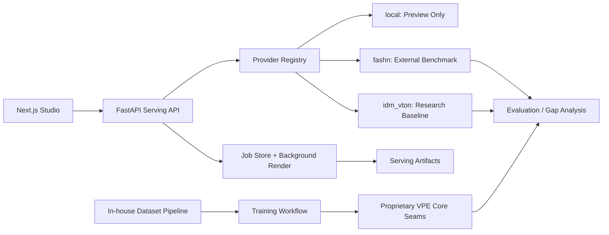

# VPE-1.0 Internship Portfolio Brief

## Project Position

VTON-Prime Engine is currently a runnable virtual try-on platform prototype. It
is not yet a completed proprietary AI model. The project demonstrates the
product surface, provider architecture, benchmark integrations, and engineering
path needed to move from third-party VTON APIs toward owned model capability.

The honest portfolio framing is:

> A production-shaped VTON platform prototype with local preview, FASHN.ai
> benchmark integration, IDM-VTON research-provider integration, catalog flow,
> serving API, evaluation seams, and a roadmap toward proprietary training.

## What Runs Today

- Next.js frontend studio at `http://127.0.0.1:3000`.
- FastAPI backend at `http://127.0.0.1:8000`.
- Upload flow for person and garment images.
- Result page that polls job state.
- Provider registry at `GET /v1/providers`.
- Real garment catalog manifest endpoint at `GET /v1/catalog/garments`.
- Local CPU preview provider for smoke testing.
- FASHN.ai adapter, enabled when an API key is available.
- IDM-VTON Hugging Face Space provider, enabled when Hugging Face quota/token is
  available.
- Python and frontend tests for the current scaffold.

## Real vs Placeholder

Real:

- Frontend/backend integration.
- Upload, status, history, and result flow.
- Provider abstraction.
- FASHN API request/status adapter.
- IDM-VTON hosted Space adapter.
- Catalog manifest structure for real product images.
- Documentation for licensing and provider boundaries.

Placeholder:

- The `local` provider is only a deterministic preview compositor.
- The proprietary model is not trained yet.
- Pose-aware, multi-view, and LoRA modules are scaffolded seams, not production
  neural components.
- Latency optimization is a benchmark path, not a TensorRT/ONNX production stack.
- Dataset pipeline is a starting point, not a mature in-house data operation.

## Architecture



## Provider Modes

```text
local
```

CPU-runnable preview mode. Useful for demonstrating frontend/backend behavior.
It is not real AI try-on.

```text
fashn
```

External FASHN.ai baseline mode. This supports faster market entry and
benchmarking, but requires `FASHN_API_KEY`.

```text
idm_vton
```

Open-source research baseline through the hosted Hugging Face Space. This gives
a real model reference, but requires `IDM_VTON_NON_COMMERCIAL_ACK=true` and
usually `IDM_VTON_HF_TOKEN` for ZeroGPU quota.

## How FASHN and IDM-VTON Fit

FASHN.ai is the commercial baseline and launch accelerator. It lets the product
flow run against an external provider while the proprietary engine is still
being developed.

IDM-VTON is the research baseline. It helps study real diffusion-based try-on:
garment conditioning, masking, DensePose/OpenPose preprocessing, and texture
preservation. Because of licensing, it should be treated as a reference and
benchmark path, not as proprietary company IP.

The proprietary VPE engine should eventually replace both as the primary
provider.

## Next Steps Toward Proprietary Engine

1. Collect licensed person/garment training and evaluation data.
2. Build a QA dataset with hard poses, occlusions, seated poses, and patterned
   garments.
3. Run baseline evaluations against FASHN and IDM-VTON.
4. Replace placeholder core components with a real diffusion/inpainting
   pipeline.
5. Add garment-preserving cross-attention or IP-Adapter-style conditioning.
6. Add pose and human-parsing preprocessing.
7. Add multi-view consistency training/evaluation.
8. Add brand-level LoRA or adapter modules.
9. Optimize inference with batching, quantization, ONNX/TensorRT, or distilled
   steps.
10. Deploy a monitored GPU inference service with artifact storage and
    regression benchmarks.

## Known Limitations

- No owned proprietary checkpoint exists yet.
- Real generation requires either FASHN credentials or Hugging Face quota.
- The current local provider should not be used for quality claims.
- IDM-VTON is not a commercial/proprietary asset without licensing review.
- Docker services are placeholders unless Docker is installed locally.
- Evaluation metrics and human preference tests are not complete yet.

## Internship Value

This project is useful as an internship application because it shows:

- practical full-stack ML product thinking;
- honest provider boundaries;
- API integration with external AI systems;
- a runnable demo;
- awareness of licensing and IP ownership;
- a concrete path from prototype to proprietary model development.

The strongest claim is not "the proprietary model is finished." The strongest
claim is "the platform and roadmap for building it are in place."
