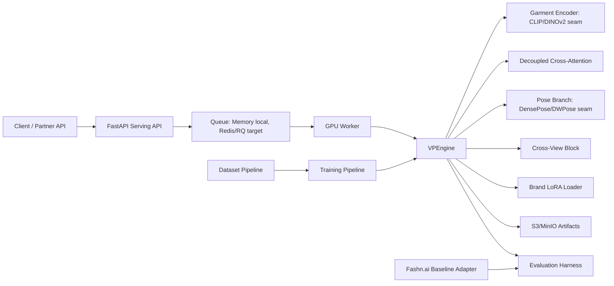

# Architecture

## Core Flow

1. The API validates image uploads and creates a `TryOnRequest`.
2. The queue stores job state and hands work to the worker.
3. `VPEngine` loads person, garment, and mask inputs.
4. The garment encoder produces projected garment features.
5. Decoupled cross-attention injects garment detail into the latent.
6. Optional pose and multi-view blocks condition the latent for difficult poses and consistent views.
7. Optional brand LoRA metadata is resolved by `brand_id`.
8. The worker writes output artifacts and updates job state.

## Upgrade Seams

- `vpe.core.garment_encoder.GarmentEncoder`: replace stub stats with DINOv2 or CLIP-ViT features.
- `vpe.core.attention.DecoupledCrossAttention`: replace NumPy stub with UNet/IP-Adapter attention processors.
- `vpe.core.pose.PoseConditioner`: replace pose-token stub with DensePose and DWPose ControlNet branches.
- `vpe.core.multiview.CrossViewAttentionBlock`: replace mean-view conditioning with learned cross-view attention.
- `vpe.core.lora.BrandLoRALoader`: wire PEFT LoRA adapters into the active pipeline.
