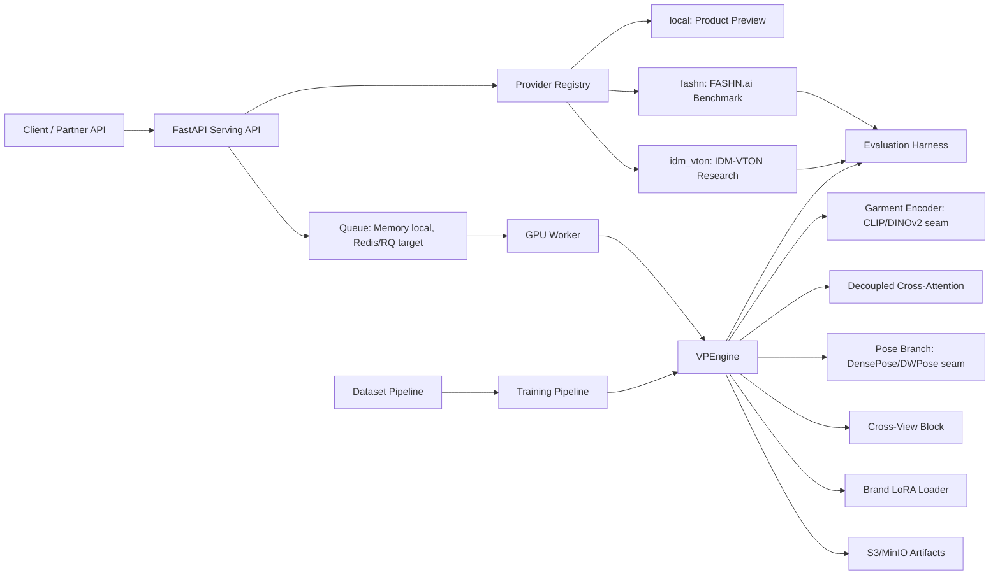

# Architecture

## Core Flow

1. The API validates image uploads and creates a `TryOnRequest`.
2. The provider registry selects `local`, `fashn`, or `idm_vton`.
3. The active provider renders through the stable product contract.
4. `local` delegates to `VPEngine` for deterministic smoke output.
5. `fashn` calls the external FASHN.ai benchmark API.
6. `idm_vton` is the self-hosted research path for real open-source VTON.
7. The worker writes output artifacts and updates job state.

## Upgrade Seams

- `vpe.core.garment_encoder.GarmentEncoder`: replace stub stats with DINOv2 or CLIP-ViT features.
- `vpe.core.attention.DecoupledCrossAttention`: replace NumPy stub with UNet/IP-Adapter attention processors.
- `vpe.core.pose.PoseConditioner`: replace pose-token stub with DensePose and DWPose ControlNet branches.
- `vpe.core.multiview.CrossViewAttentionBlock`: replace mean-view conditioning with learned cross-view attention.
- `vpe.core.lora.BrandLoRALoader`: wire PEFT LoRA adapters into the active pipeline.
- `vpe.providers.idm_vton.IDMVTONResearchProvider`: wire a separate IDM-VTON checkout into serving without copying upstream code/checkpoints into the proprietary path.
